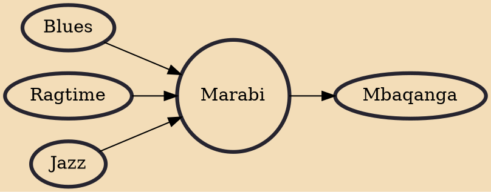

Marabi is a style of music that evolved in South Africa over the last century. The early part of the 20th century saw the increasing urbanisation of black South Africans in mining centres such as the gold mining area around Johannesburg - the Witwatersrand. This led to the development of township slums or ghettos, and out of this hardship came forth new forms of music, marabi and kwela amongst others.

## Influences

- [[Blues]]
- [[Ragtime]]
- [[Jazz]]

## Derivatives

- [[Mbaqanga]]
