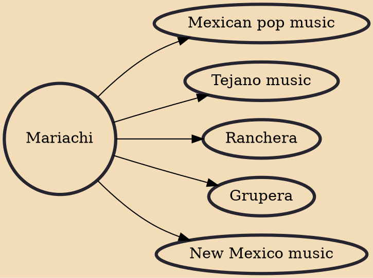

Mariachi (US: /ˌmɑːriˈɑːtʃi/, UK: /ˌmær-/, Spanish: [maˈɾjatʃi]) is a genre of regional Mexican music that dates back to at least the 18th century, evolving over time in the countryside of various regions of western Mexico. The usual mariachi group today consists of as many as eight violins, two trumpets and at least one guitar, including a high-pitched vihuela and an acoustic bass guitar called a guitarrón, and all players taking turns singing lead and doing backup vocals.

## Derivatives
- [[Mexican pop music]]
- [[Tejano music]]
- [[Ranchera]]
- [[Grupera]]
- [[New Mexico music]]
