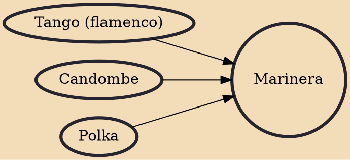

Marinera is a courtship dance that originated along the coastal regions of Peru, using handkerchiefs as props. The dance is a mix of Spanish contradanza and Andean zamacueca, and is a stylized reenactment of a courtship, showing a blend of the different cultures of Peru. The dance has gained recognition throughout South America and is known as the most prominent traditional dance of Peru. The city of Trujillo has been recognized as the national birthplace of the marinera since 1986. The Marinera Festival, a cultural event dedicated to marinera held in Trujillo, has held annual competitions of the dance since 1960. In 2012, the Congress of Peru observed nationally October 7 as a commemorative day for the marinera.

## Influences
- [[Tango (flamenco)]]
- [[Candombe]]
- [[Polka]]
