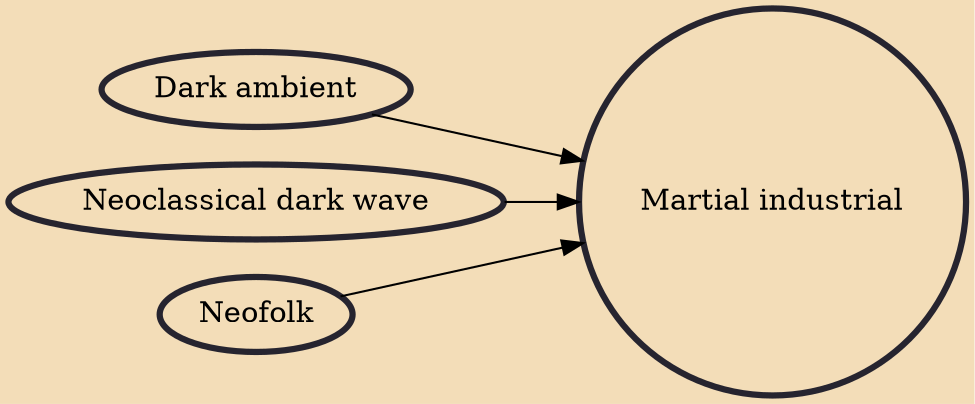

Martial industrial is a syncretic offshoot of industrial music characterized by noise, dark ambient atmospheres, neofolk melodies, dark wave tunes and neoclassical orchestrations as well as the incorporation of audio from military marches, historical speeches and political, apolitical or metapolitical lyrics. Unlike other post-industrial genres, martial industrial is typically interested more in a particular worldview or philosophy than pure experimentalism.

## Influences
- [[Dark ambient]]
- [[Neoclassical dark wave]]
- [[Neofolk]]
