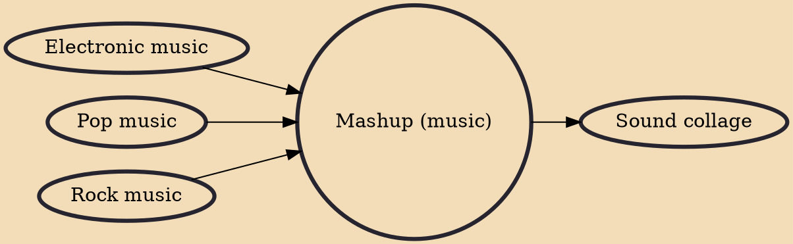

A mashup (also mesh, mash up, mash-up, blend, bastard pop or bootleg) is a creative work, usually a song, created by blending two or more pre-recorded songs, typically by superimposing the vocal track of one song seamlessly over the instrumental track of another and changing the tempo and key where necessary. Such works are considerd "transformative" of original content and in the United States they may find protection from copyright claims under the "fair use" doctrine of copyright law.

## Influences

- [[Electronic music]]
- [[Pop music]]
- [[Rock music]]

## Derivatives

- [[Sound collage]]
