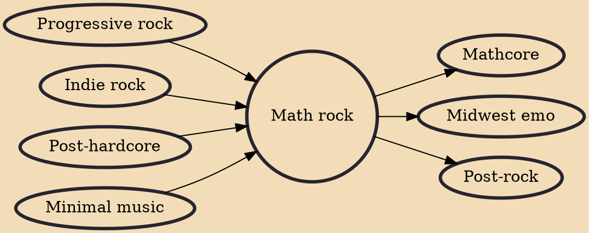

Math rock is a style of progressive and indie rock with roots in bands such as King Crimson and Rush as well as 20th-century minimal music composers such as Steve Reich. It is characterized by complex, atypical rhythmic structures (including irregular stopping and starting), counterpoint, odd time signatures, angular melodies, and extended, often dissonant, chords. It bears similarities to post-rock.

## Influences
- [[Progressive rock]]
- [[Indie rock]]
- [[Post-hardcore]]
- [[Minimal music]]

## Derivatives
- [[Mathcore]]
- [[Midwest emo]]
- [[Post-rock]]
