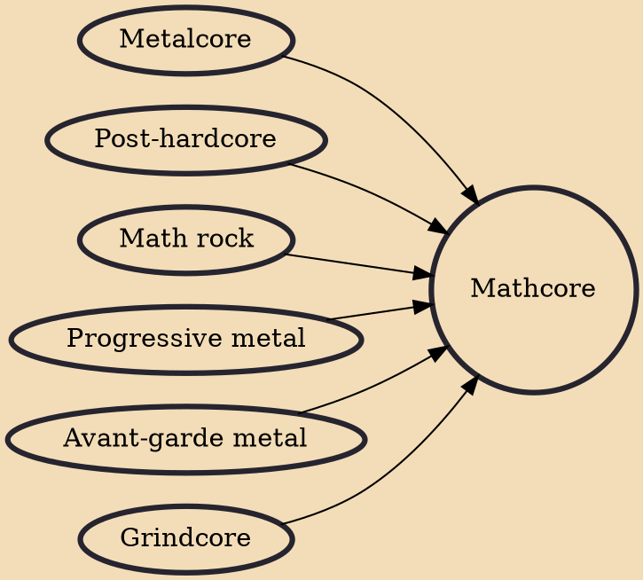

Mathcore is a subgenre of hardcore punk and metalcore influenced by post-hardcore, extreme metal and math rock that developed during the 1990s. Bands in the genre emphasize complex and fluctuant rhythms through the use of irregular time signatures, polymeters, syncopations and tempo changes. Early mathcore lyrics were addressed from a realistic worldview and with a pessimistic, defiant, resentful or sarcastic point of view.

## Influences
- [[Metalcore]]
- [[Post-hardcore]]
- [[Math rock]]
- [[Progressive metal]]
- [[Avant-garde metal]]
- [[Grindcore]]
