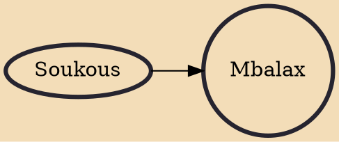

Mbalax (or mbalakh) is the national popular dance music of Senegal and the Gambia. In the 1970s, mbalax emerged as the distinctive sound of postcolonial Senegal. Derived from a fusion of indigenous Wolof sabar drumming with popular music principally from the African diaspora and African popular music, and to a lesser extent Western pop and afropop. Although the fusion of indigenous music with urban dance music from the diaspora and west is not new, the pan-ethnic quality of urban Wolofness provided a space for the inclusion and representation of a plethora of ethnic sounds of the Pulaar/Tukulor, Sereer, Soce, Mande and other groups from the Greater Senegambia Region. The name mbalax derives from the accompanying rhythms of the Wolof sabar and was coined by Youssou N'Dour even though, as he

## Influences

- [[Soukous]]
