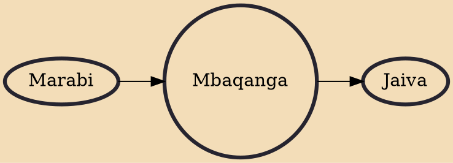

Mbaqanga (Zulu pronunciation: [mɓaˈǃáːŋa]) is a style of South African music with rural Zulu roots that continues to influence musicians worldwide today. The style originated in the early 1960s.

## Influences
- [[Marabi]]

## Derivatives
- [[Jaiva]]
