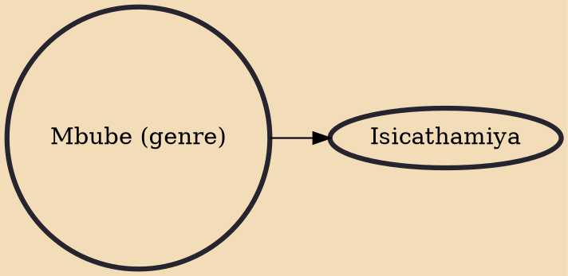

Mbube is a form of South African vocal music, made famous by the South African group Ladysmith Black Mambazo. The word mbube means "lion" in Zulu. Traditionally performed a cappella, the members of the group are male although a few groups have a female singer. In this form, groups of voices singing homophonically in rhythmic unison are employed to create intricate harmonies and textures.

## Derivatives
- [[Isicathamiya]]
