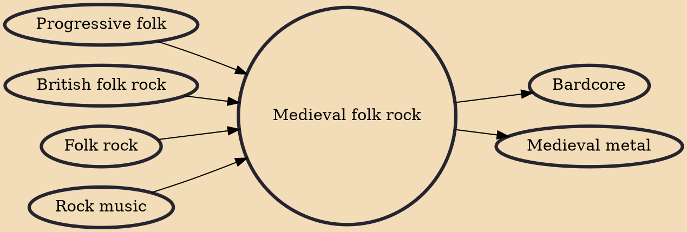

Medieval folk rock, medieval rock or medieval folk is a musical subgenre that emerged in the early 1970s in England and Germany which combined elements of early music with rock music. It grew out of the British folk rock and progressive folk movements of the late 1960s. Despite the name, the term was used indiscriminately to categorise performers who incorporated elements of medieval, renaissance and baroque music into their work and sometimes to describe groups who used few, or no, electric instruments. This subgenre reached its height towards the middle of the 1970s when it achieved some mainstream success in Britain, but within a few years most groups had either disbanded, or were absorbed into the wider movements of progressive folk and progressive rock. Nevertheless, the genre had a c

## Influences

- [[Progressive folk]]
- [[British folk rock]]
- [[Folk rock]]
- [[Rock music]]

## Derivatives

- [[Bardcore]]
- [[Medieval metal]]
