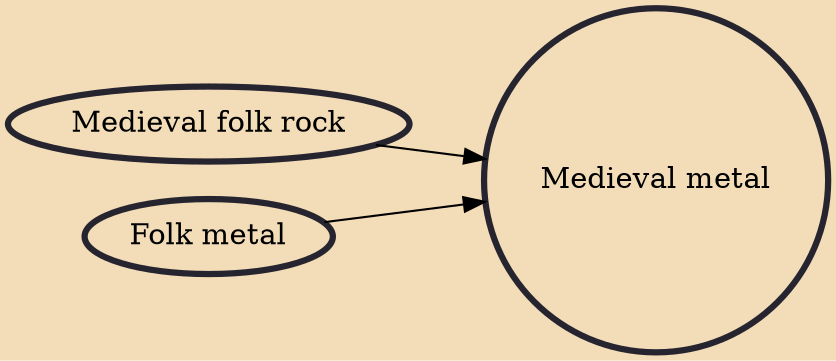

Medieval metal is a subgenre of folk metal that blends heavy metal music with medieval folk music. Medieval metal is mostly restricted to Germany where it is known as Mittelalter-Metal or Mittelalter-Rock. The genre emerged from the middle of the 1990s with contributions from Subway to Sally, In Extremo and Schandmaul. The style is characterised by the prominent use of a wide variety of traditional folk and medieval instruments.

## Influences
- [[Medieval folk rock]]
- [[Folk metal]]
