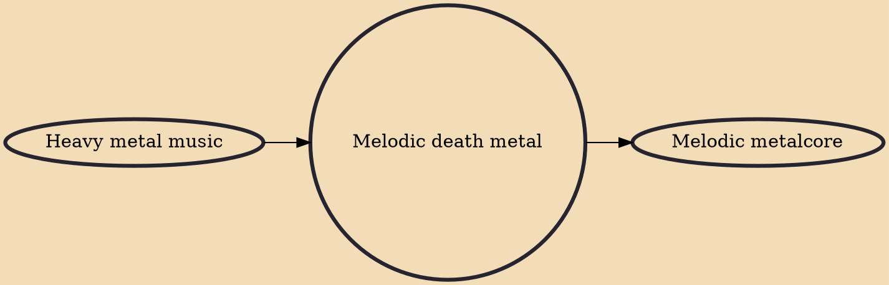

Melodic death metal (also referred to as melodeath) is a subgenre of death metal that employs highly melodic guitar riffs, often borrowing from traditional heavy metal (including New Wave of British Heavy Metal). The genre features the heaviness of death metal but with highly melodic or harmonized guitar riffs and solos, and often features high-pitched shrieked vocals (differing from traditional death metal) alongside the low-pitched growls commonly featured in traditional death metal. Pioneered by the English heavy metal band Carcass with their 1993 album Heartwork, melodic death metal developed further in Sweden (developed by bands like At the Gates, Dark Tranquillity, and In Flames) in the mid-1990s. The Swedish death metal scene did much to popularise the style, soon centering in the "

## Influences
- [[Heavy metal music]]

## Derivatives
- [[Melodic metalcore]]
