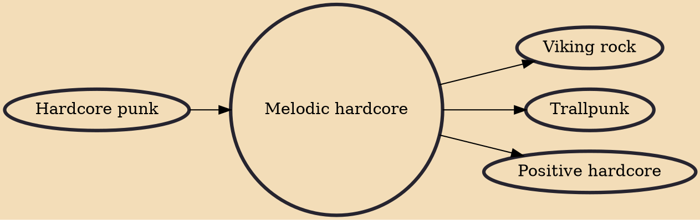

Melodic hardcore is a broadly defined subgenre of hardcore punk with a strong emphasis on melody in its guitar work. It generally incorporates fast rhythms, melodic and often distorted guitar riffs, and vocal styles tending towards shouting and screaming. Nevertheless, the genre has been very diverse, with different bands showcasing very different styles. Many pioneering melodic hardcore bands (such as Bad Religion and Descendents), have proven influential across the spectrum of punk rock, as well as rock music more generally. The term "melodic punk" is often used to describe both melodic hardcore and skate punk bands.

## Influences

- [[Hardcore punk]]

## Derivatives

- [[Viking rock]]
- [[Trallpunk]]
- [[Positive hardcore]]
