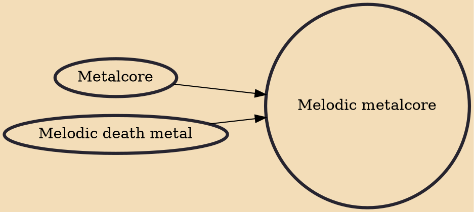

Melodic metalcore is a fusion genre, incorporating elements of melodic death metal and metalcore; it has a heavy emphasis on melodic instrumentation, distorted guitar tones, palm muting, double bass drumming, blast beats, metalcore-stylized breakdowns, aggressive screaming, death growls, and clean singing. The genre has seen commercial success for employing a more accessible sound at times compared to other forms of extreme music. Many notable melodic metalcore bands have been influenced by At the Gates and In Flames.

## Influences
- [[Metalcore]]
- [[Melodic death metal]]
