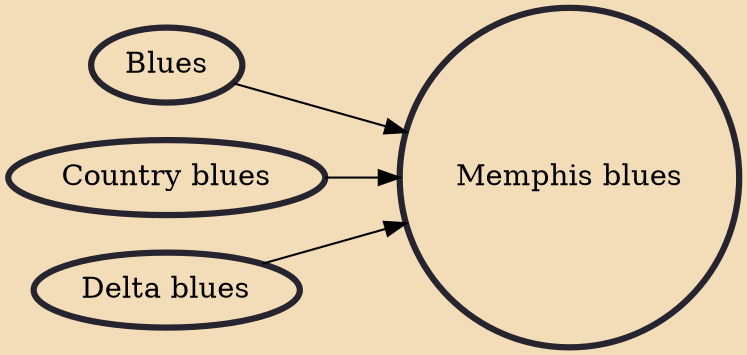

The Memphis blues is a style of blues music created from the 1910s to the 1930s by musicians in the Memphis area, such as Frank Stokes, Sleepy John Estes, Furry Lewis and Memphis Minnie. The style was popular in vaudeville and medicine shows and was associated with Beale Street, the main entertainment area in Memphis, W. C. Handy, the "Father of the Blues", published the song "The Memphis Blues". In lyrics, the phrase has been used to describe a depressed mood.

## Influences

- [[Blues]]
- [[Country blues]]
- [[Delta blues]]
