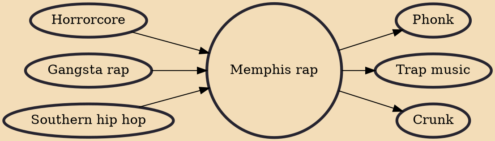

Memphis rap, also known as Memphis hip hop or Memphis horrorcore, is a regional subgenre of hip hop music that originated in Memphis, Tennessee in the mid-late 1980s.

## Influences
- [[Horrorcore]]
- [[Gangsta rap]]
- [[Southern hip hop]]

## Derivatives
- [[Phonk]]
- [[Trap music]]
- [[Crunk]]
