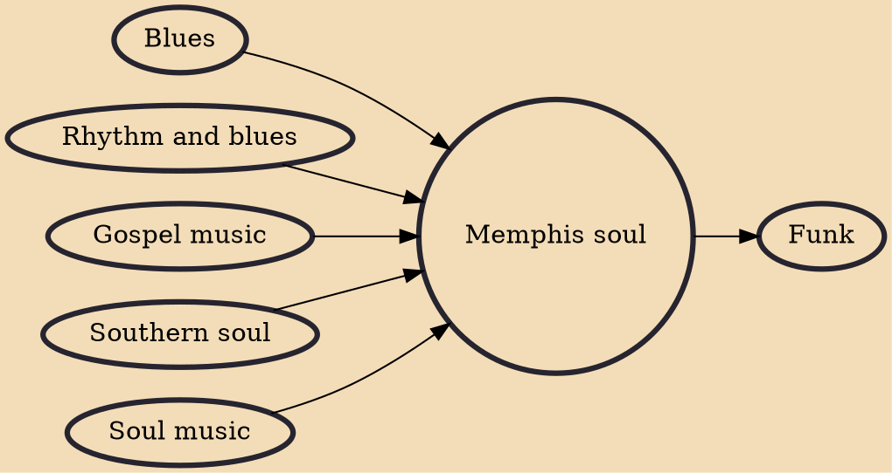

Memphis soul, also known as the Memphis sound, is the most prominent strain of Southern soul. It is a shimmering, sultry style produced in the 1960s and 1970s at Stax Records and Hi Records in Memphis, Tennessee, featuring melodic unison horn lines, organ, guitar, bass, and a driving beat on the drums.

## Influences

- [[Blues]]
- [[Rhythm and blues]]
- [[Gospel music]]
- [[Southern soul]]
- [[Soul music]]

## Derivatives

- [[Funk]]
