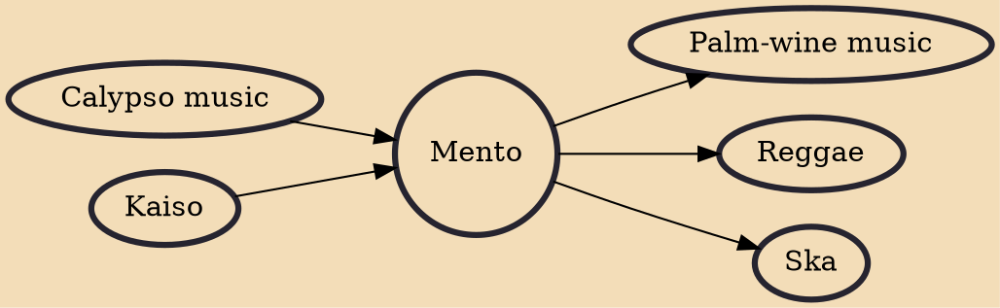

Mento is a style of Jamaican folk music that predates and has greatly influenced ska and reggae music. It is a fusion of African rhythmic elements and European elements, which reached peak popularity in the 1940s and 1950s. Mento typically features acoustic instruments, such as acoustic guitar, banjo, hand drums, and the rhumba box — a large mbira in the shape of a box that can be sat on while played. The rhumba box carries the bass part of the music.

## Influences
- [[Calypso music]]
- [[Kaiso]]

## Derivatives
- [[Palm-wine music]]
- [[Reggae]]
- [[Ska]]
