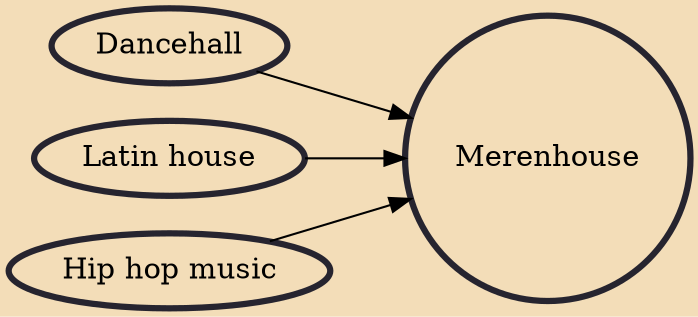

Merenhouse, merenrap or electronic merengue,Mambo o Mambo de Calle is a style of Dominican merengue music formed by blending with dancehall reggae and hip hop. The mix of Latin music, house music and dancehall started in NYC in the late 1980s.

## Influences
- [[Dancehall]]
- [[Latin house]]
- [[Hip hop music]]
