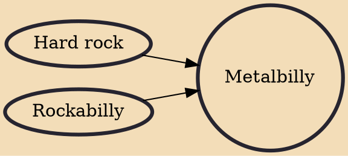

```dot
digraph {
	graph [bgcolor="#F3DDB8" rankdir=LR]
	node [color="#26242F" penwidth=3.0]
	Metalbilly [shape=circle]
	"Hard rock" [URL="/hard-rock/"]
	"Hard rock" -> Metalbilly
	Rockabilly [URL="/rockabilly/"]
	Rockabilly -> Metalbilly
}
```

Metalbilly is the fusion of hard rock music with rockabilly.

## Influences
- [[Hard rock]]
- [[Rockabilly]]
