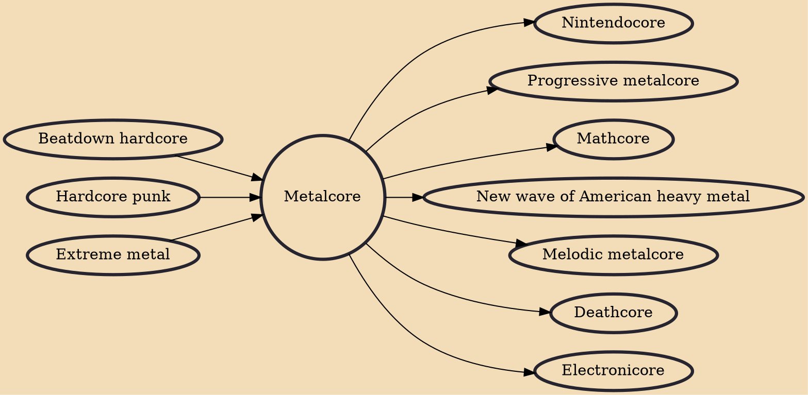

Metalcore (also known as metallic hardcore) is a fusion music genre that combines elements of extreme metal and hardcore punk. As with other styles blending metal and hardcore, such as crust punk and grindcore, metalcore is noted for its use of breakdowns, slow, intense passages conducive to moshing. Other defining instrumental qualities include heavy riffs and stop-start rhythm guitar playing, occasional blast beats, and double bass drumming. Vocalists in the genre typically use thrash or scream vocals. Some later metalcore bands combine this with clean singing, often during the chorus. Death growls and gang vocals are common. 1990s metalcore bands were inspired by hardcore while later metalcore bands were inspired by melodic death metal bands like At the Gates and In Flames.

## Influences
- [[Beatdown hardcore]]
- [[Hardcore punk]]
- [[Extreme metal]]

## Derivatives
- [[Nintendocore]]
- [[Progressive metalcore]]
- [[Mathcore]]
- [[New wave of American heavy metal]]
- [[Melodic metalcore]]
- [[Deathcore]]
- [[Electronicore]]
