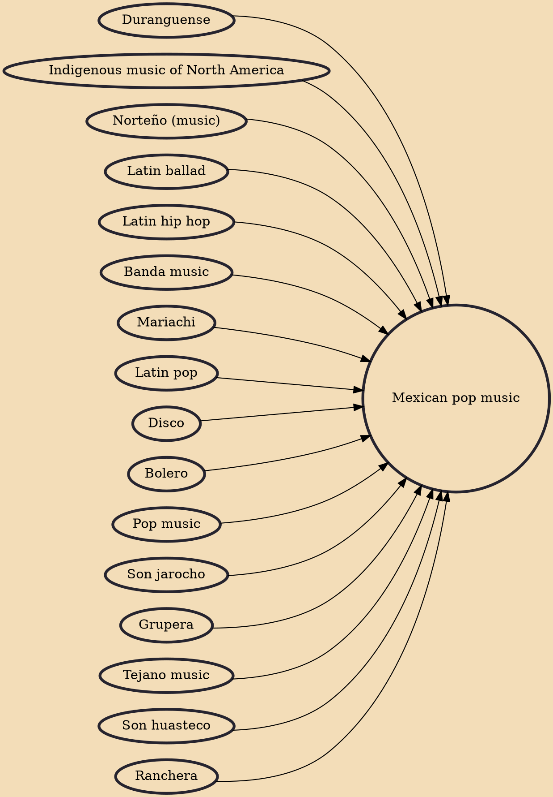

Mexican pop is a music genre produced in Mexico, particularly intended for teenagers and young adults. Mexico is the country that exports the most entertainment in Spanish language. Mexican pop was limited to Latin America until the mid-1990s, when an interest towards this type of music increased after Selena's, Luis Miguel's, Paulina Rubio's, Thalía's and Angélica María's debuts before the mainstream USA audience.

## Influences

- [[Duranguense]]
- [[Indigenous music of North America]]
- [[Norteño (music)]]
- [[Latin ballad]]
- [[Latin hip hop]]
- [[Banda music]]
- [[Mariachi]]
- [[Latin pop]]
- [[Disco]]
- [[Bolero]]
- [[Pop music]]
- [[Son jarocho]]
- [[Grupera]]
- [[Tejano music]]
- [[Son huasteco]]
- [[Ranchera]]
