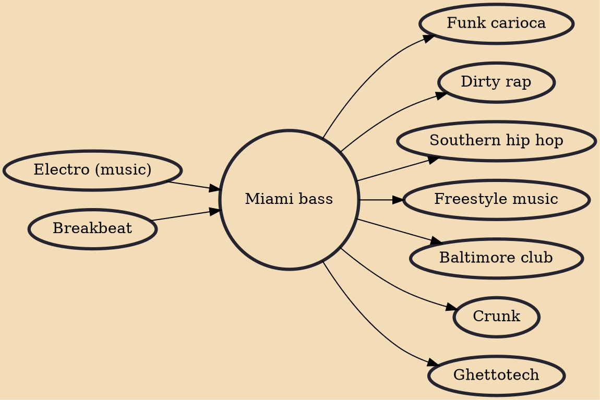

Miami bass (booty music or booty bass) is a subgenre of hip hop music that became popular in the 1980s and 1990s. The use of drums from the Roland TR-808, sustained kick drum, heavy bass, raised dance tempos, and frequently sexually explicit lyrical content differentiate it from other hip hop subgenres. Music author Richie Unterberger has characterized Miami bass as using rhythms with a "stop-start flavor" and "hissy" cymbals with lyrics that "reflected the language of the streets, particularly Miami's historically black neighborhoods such as Liberty City, Goulds and Overtown".

## Influences

- [[Electro (music)]]
- [[Breakbeat]]

## Derivatives

- [[Funk carioca]]
- [[Dirty rap]]
- [[Southern hip hop]]
- [[Freestyle music]]
- [[Baltimore club]]
- [[Crunk]]
- [[Ghettotech]]
