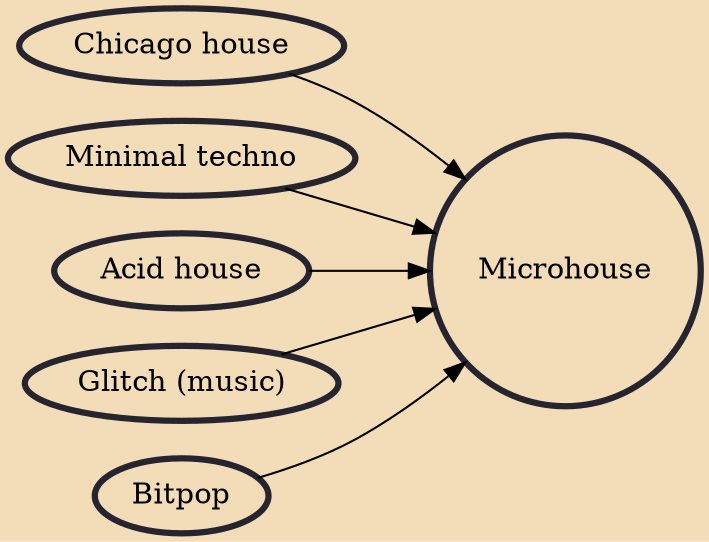

Microhouse, buftech or sometimes just minimal, is a subgenre of house music strongly influenced by minimalism and 1990s techno.

## Influences
- [[Chicago house]]
- [[Minimal techno]]
- [[Acid house]]
- [[Glitch (music)]]
- [[Bitpop]]
