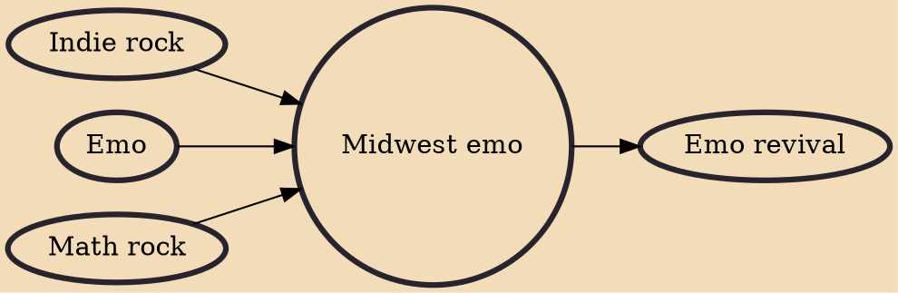

Midwest emo (or Midwestern emo) refers to the emo scene and/or subgenre that developed in 1990s Midwestern United States. Employing unconventional vocal stylings, distinct guitar riffs and arpeggiated melodies, Midwest emo bands shifted away from the genre's hardcore punk roots and drew on indie rock and math rock approaches. According to the author and critic Andy Greenwald, "this was the period when emo earned many, if not all, of the stereotypes that have lasted to this day: boy-driven, glasses-wearing, overly sensitive, overly brainy, chiming-guitar-driven college music." Midwest emo is sometimes used interchangeably with "second-wave emo". Although not implied by the name, Midwest emo does not solely refer to bands and artists from the Midwestern United States, and the style is played

## Influences

- [[Indie rock]]
- [[Emo]]
- [[Math rock]]

## Derivatives

- [[Emo revival]]
