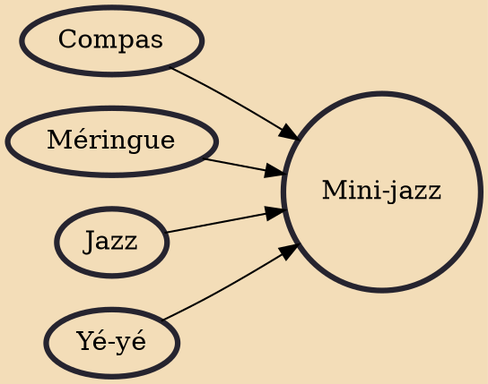

Mini-jazz (Haitian Creole: mini-djaz) is a reduced méringue-compas band format of the mid-1960s characterized by the rock band formula of two guitars, one bass, and drum-conga-cowbell; some use an alto sax or a full horn section, while others use a keyboard, accordion or lead guitar.

## Influences
- [[Compas]]
- [[Méringue]]
- [[Jazz]]
- [[Yé-yé]]
