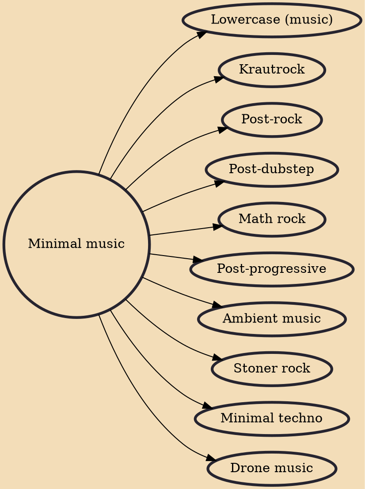

Minimal music (also called minimalism) is a form of art music or other compositional practice that employs limited or minimal musical materials. Prominent features of minimalist music include repetitive patterns or pulses, steady drones, consonant harmony, and reiteration of musical phrases or smaller units. It may include features such as phase shifting, resulting in what is termed phase music, or process techniques that follow strict rules, usually described as process music. The approach is marked by a non-narrative, non-teleological, and non-representational approach, and calls attention to the activity of listening by focusing on the internal processes of the music.

## Derivatives

- [[Lowercase (music)]]
- [[Krautrock]]
- [[Post-rock]]
- [[Post-dubstep]]
- [[Math rock]]
- [[Post-progressive]]
- [[Ambient music]]
- [[Stoner rock]]
- [[Minimal techno]]
- [[Drone music]]
