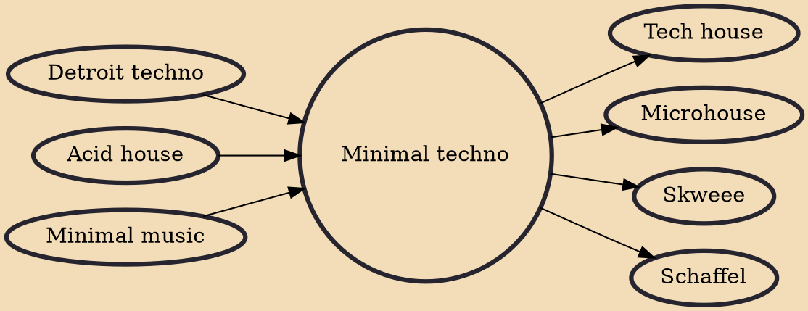

Minimal techno is a subgenre of techno music. It is characterized by a stripped-down aesthetic that exploits the use of repetition and understated development. Minimal techno is thought to have been originally developed in the early 1990s by Detroit-based producers Robert Hood and Daniel Bell. By the early 2000s the term 'minimal' generally described a style of techno that was popularized in Germany by labels such as Kompakt, Perlon, and Richie Hawtin's M-nus, among others.

## Influences
- [[Detroit techno]]
- [[Acid house]]
- [[Minimal music]]

## Derivatives
- [[Tech house]]
- [[Microhouse]]
- [[Skweee]]
- [[Schaffel]]
