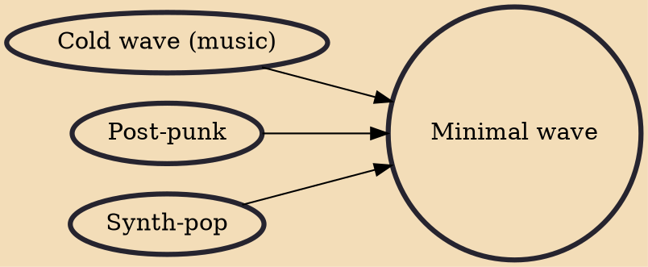

Minimal wave is a broad classification of music that comprises obscure, atypical examples of genres such as new wave, stripped-down electronic or synthesizer music, synth-pop, post-punk, and coldwave. Most of the music tends to focus on electronic, pre-MIDI instrumentation and themes of sincere, rather than ironic, detachment.

## Influences
- [[Cold wave (music)]]
- [[Post-punk]]
- [[Synth-pop]]
