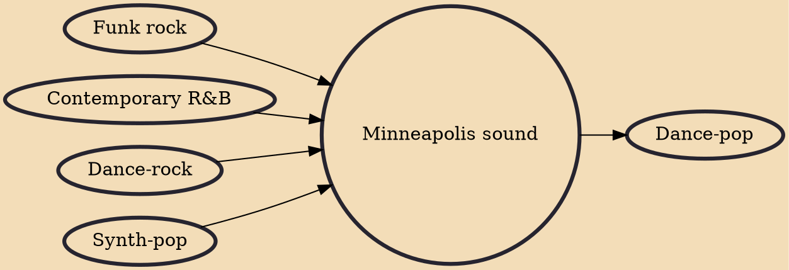

The Minneapolis sound is a subgenre of funk rock with elements of new wave and synth-pop, that was pioneered by Minneapolis, Minnesota-based musician Prince in the late 1970s. Its popularity was given a boost throughout the 1980s thanks to Prince and groups he organized or produced, including the Time, Vanity 6, Apollonia 6, Sheila E., the Family, and the offshoots from his band the Revolution, Wendy & Lisa and Brownmark. After leaving the Time, Jimmy Jam & Terry Lewis, Morris Day, and Jesse Johnson all moved on to successful careers. Minneapolis acts not directly associated with Prince also utilized this musical style, including Ta Mara & the Seen, Mazarati, the Jets.

## Influences

- [[Funk rock]]
- [[Contemporary R&B]]
- [[Dance-rock]]
- [[Synth-pop]]

## Derivatives

- [[Dance-pop]]
