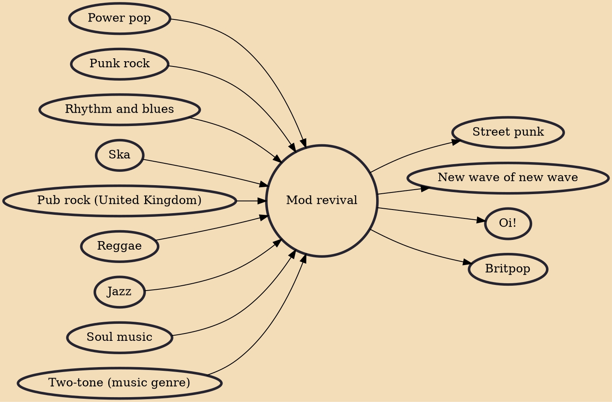

The mod revival was a subculture that started in the United Kingdom in the late 1970s and later spread to other countries (to a lesser degree). The mod revival's mainstream popularity was relatively short, although its influence lasted for decades. The mod revival post-dated a Teddy Boy revival, and mod revivalists sometimes clashed with Teddy Boy revivalists, skinhead revivalists, casuals, punks and rival gang members.

## Influences

- [[Power pop]]
- [[Punk rock]]
- [[Rhythm and blues]]
- [[Ska]]
- [[Pub rock (United Kingdom)]]
- [[Reggae]]
- [[Jazz]]
- [[Soul music]]
- [[Two-tone (music genre)]]

## Derivatives

- [[Street punk]]
- [[New wave of new wave]]
- [[Oi!]]
- [[Britpop]]
