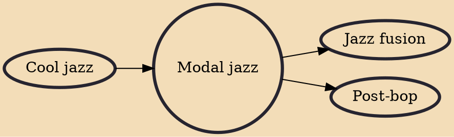

Modal jazz is jazz that makes use of musical modes, often modulating among them to accompany the chords instead of relying on one tonal center used across the piece. Although precedents exist, modal jazz was crystallized as a theory by composer George Russell in his 1953 book Lydian Chromatic Concept of Tonal Organization.

## Influences
- [[Cool jazz]]

## Derivatives
- [[Jazz fusion]]
- [[Post-bop]]
