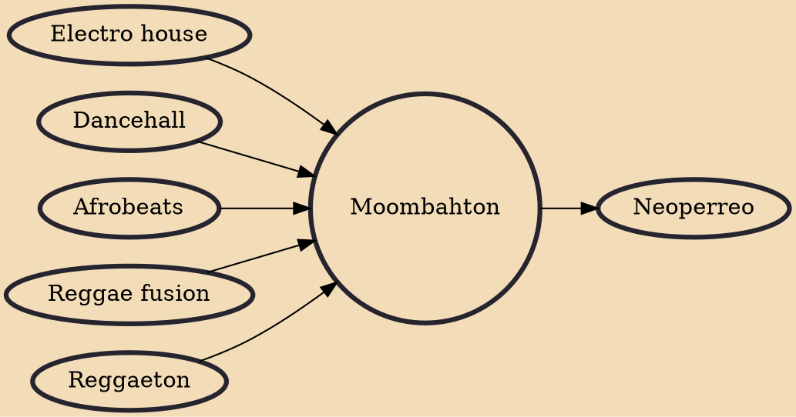

Moombahton (/ˈmuːmbətɒn/, MOOM-bə-ton) is an electronic dance music genre, derived from house music and reggaeton, that was created by American DJ and producer Dave Nada in Washington, D.C., in 2009. Nada coined the name as a portmanteau of "Moombah" (a track by Surinamese house DJ Chuckie and Dutch producer/DJ Silvio Ecomo) and reggaeton (itself a neologism combining reggae with the Spanish suffix -ton, signifying big).

## Influences
- [[Electro house]]
- [[Dancehall]]
- [[Afrobeats]]
- [[Reggae fusion]]
- [[Reggaeton]]

## Derivatives
- [[Neoperreo]]
