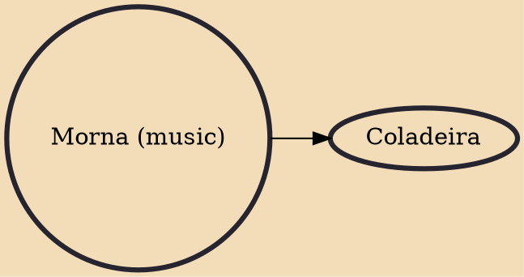

The morna (pronunciation in both Portuguese and Cape Verdean Creole: [ˈmɔɾnɐ]) is a music and dance genre from Cape Verde. Lyrics are usually in Cape Verdean Creole, and instrumentation often includes cavaquinho, clarinet, accordion, violin, piano and guitar. Morna is widely considered the national music of Cape Verde, as is the fado for Portugal, the tango for Argentina, the merengue for Dominican Republic, the rumba for Cuba, and so on.

## Derivatives

- [[Coladeira]]
