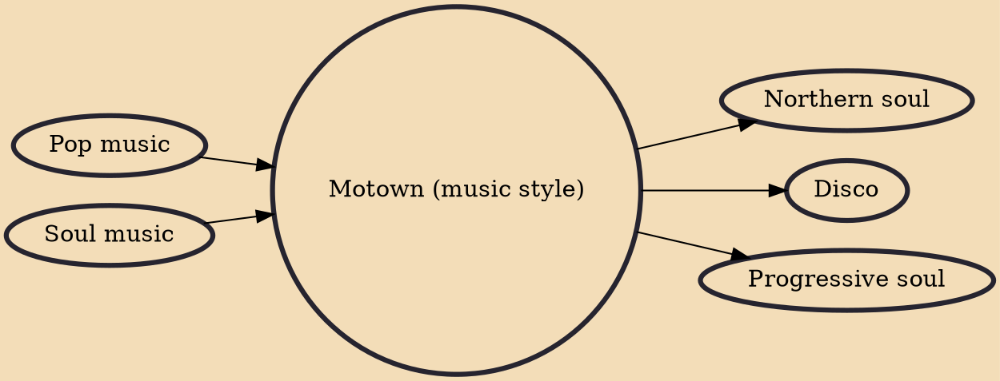

Motown, or the Motown sound, is a style of rhythm and blues music named after the record company Motown in Detroit, where teams of songwriters and musicians produced material for girl groups, boy bands, and solo singers during the 1960s and early 1970s. The music of Motown helped a small record company become the largest Black American-owned enterprise in the country and a national music industry competitor in the United States.

## Influences
- [[Pop music]]
- [[Soul music]]

## Derivatives
- [[Northern soul]]
- [[Disco]]
- [[Progressive soul]]
