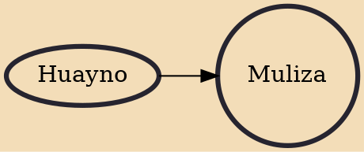

Muliza is a traditional music and dance style from Cerro de Pasco, Pasco region, Peru. Other sources mention that it was originated in Tarma, Junín region, disputing both cities the origin of the dance. Popularized at the end of the 19th century, on February 3, 2014 it was declared a national cultural heritage.

## Influences

- [[Huayno]]
