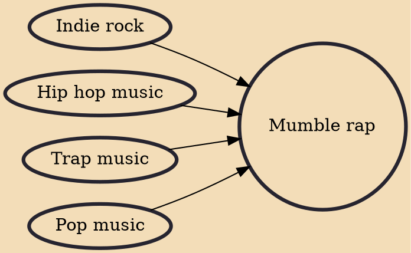

Mumble rap (often referred to as "SoundCloud rap") is a loosely defined microgenre of hip hop that largely spread on the online audio distribution platform SoundCloud in the 2010s. The term implies a mumbling or unclear vocal delivery by artists, and may generally refer to rappers who do not share the genre's traditional emphasis on lyricism.

## Influences
- [[Indie rock]]
- [[Hip hop music]]
- [[Trap music]]
- [[Pop music]]
