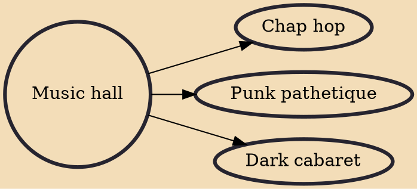

Music hall is a type of British theatrical entertainment that was popular from the early Victorian era, beginning around 1850. It faded away after 1918 as the halls rebranded their entertainment as variety. Perceptions of a distinction in Britain between bold and scandalous Victorian Music Hall and subsequent, more respectable Variety differ. Music hall involved a mixture of popular songs, comedy, , and variety entertainment. The term is derived from a type of theatre or venue in which such entertainment took place. In North America vaudeville was in some ways analogous to British music hall, featuring rousing songs and comic acts.

## Derivatives
- [[Chap hop]]
- [[Punk pathetique]]
- [[Dark cabaret]]
