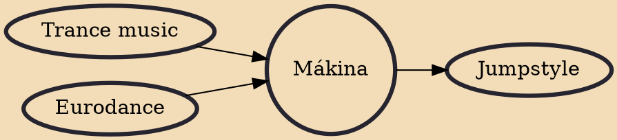

Mákina is a subgenre of hardcore techno, originating in Spain. Similar to UK hardcore, it includes elements of bouncy techno and hard trance. The tempo ranges from 150 to 180 BPM.

## Influences
- [[Trance music]]
- [[Eurodance]]

## Derivatives
- [[Jumpstyle]]
