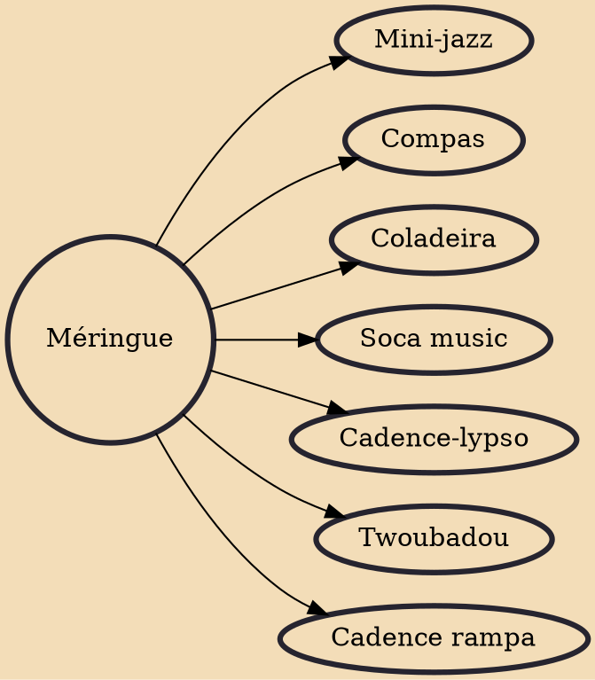

Méringue (French pronunciation: ​[meʁɛ̃ɡ]; Haitian Creole: mereng), also called méringue lente or méringue de salon (slow or salon méringue), is a dance music and national symbol in Haiti. It is a string-based style played on the lute, guitar, horn section, piano, and other string instruments unlike the accordion-based merengue, and is generally sung in Haitian Creole and French, as well as in English and Spanish.

## Derivatives

- [[Mini-jazz]]
- [[Compas]]
- [[Coladeira]]
- [[Soca music]]
- [[Cadence-lypso]]
- [[Twoubadou]]
- [[Cadence rampa]]
