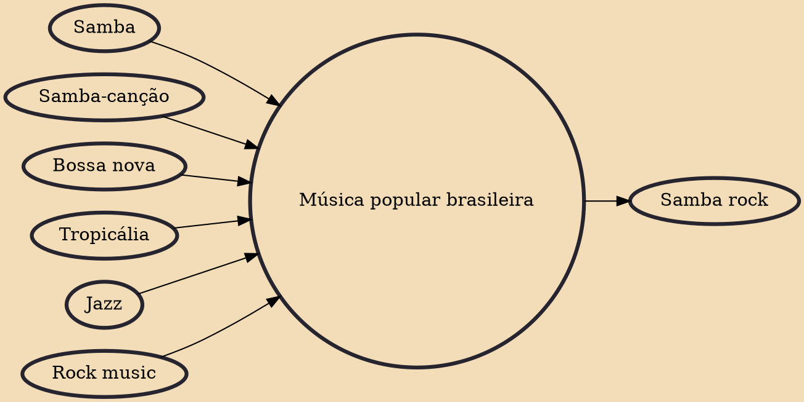

Música popular brasileira (Portuguese pronunciation: [ˈmuzikɐ popuˈlaʁ bɾaziˈlejɾɐ], Popular Brazilian Music) or MPB is a trend in post-bossa nova urban popular music in Brazil that revisits typical Brazilian styles such as samba, samba-canção and baião and other Brazilian regional music, combining them with foreign influences, such as jazz and rock. Variations within MPB were the short-lived but influential artistic movement known as tropicália, and the music of samba rock. Many of the albums on Rolling Stone Brazil's list of the 100 greatest Brazilian albums fall under the MPB style.

## Influences
- [[Samba]]
- [[Samba-canção]]
- [[Bossa nova]]
- [[Tropicália]]
- [[Jazz]]
- [[Rock music]]

## Derivatives
- [[Samba rock]]
