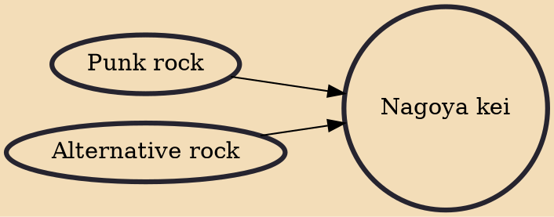

Nagoya kei (Japanese: 名古屋系, lit. "Nagoya Style") is a subgenre of the Japanese visual kei movement that developed in the early 1990s music scene of Nagoya, Japan. The term actually developed before visual kei was coined, and gradually died out as the latter gained more popularity. Often considered darker and gloomier than visual kei both musically and lyrically, Nagoya kei takes its influences more so from western (specifically British) punk rock and alternative rock bands. The focus of the bands tends to be much less on costume and makeup in favor of more complex musical compositions and concentration on the music itself.

## Influences
- [[Punk rock]]
- [[Alternative rock]]
