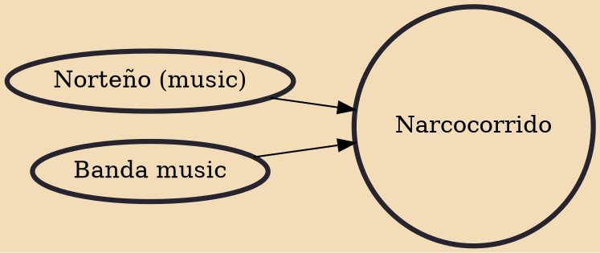

A narcocorrido (Spanish pronunciation: [naɾkokoˈriðo], "narco-corrido" or drug ballad) is a subgenre of the Regional Mexican corrido (narrative ballad) genre, from which several other genres have evolved. This type of music is heard and produced on both sides of the Mexico–US border. It uses a danceable, polka, waltz or mazurka rhythmic base. Narcocorrido lyrics refer to particular events and include real dates and places. The lyrics tend to speak approvingly of illegal activities, mainly drug trafficking.

## Influences

- [[Norteño (music)]]
- [[Banda music]]
