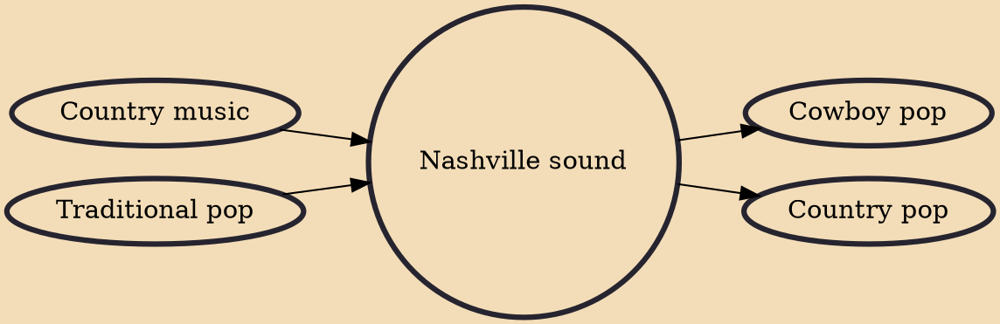

The Nashville Sound originated during the mid-1950s as a subgenre of American country music, replacing the chart dominance of the rough honky tonk music, which was most popular in the 1940s and 1950s, with "smooth strings and choruses", "sophisticated background vocals" and "smooth tempos" associated with traditional pop. It was an attempt "to revive country sales, which had been devastated by the rise of rock 'n' roll" as a distinct genre from the rockabilly spawned from it.

## Influences
- [[Country music]]
- [[Traditional pop]]

## Derivatives
- [[Cowboy pop]]
- [[Country pop]]
