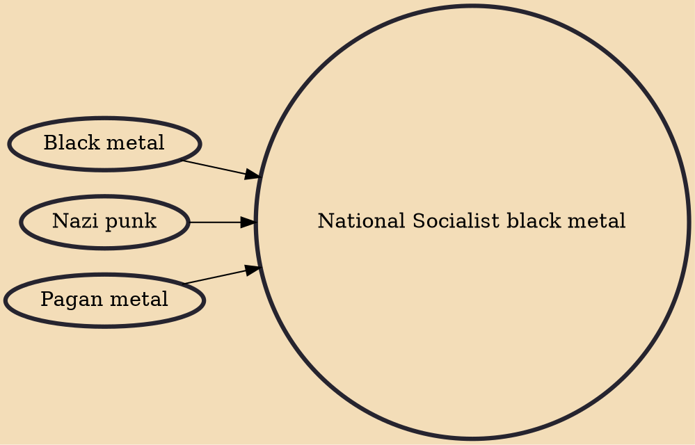

National Socialist black metal, also known as NSBM, Aryan black metal, and Neo-Nazi black metal, is a political movement and subgenre within the black metal music scene that promotes neo-Nazism, Fascism, and white supremacist ideologies. NSBM artists typically combine neo-Nazi imagery and ideology with ethnic European paganism, Satanism, or Nazi occultism, or a combination thereof, and vehemently oppose Christianity, Islam and Judaism from a racialist viewpoint. NSBM is not seen as a distinct genre, but as a völkisch movement within black metal. According to Mattias Gardell, NSBM musicians see this ideology as "a logical extension of the political and spiritual dissidence inherent in black metal".

## Influences
- [[Black metal]]
- [[Nazi punk]]
- [[Pagan metal]]
