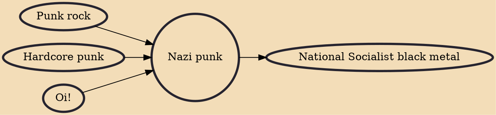

A Nazi punk is a neo-Nazi who is part of the punk subculture. The term also describes the related music genre, which is sometimes also referred to as hatecore. Nazi Punk music generally sounds like other forms of punk rock, but differs by having lyrics that express hatred of some ethnic minorities, Jews, communists, homosexuals, anarchists, and other perceived enemies. It is a subgenre of punk that contrasts sharply with the anti-authoritarian and frequently leftist ideas prevalent in much of the punk subculture.

## Influences
- [[Punk rock]]
- [[Hardcore punk]]
- [[Oi!]]

## Derivatives
- [[National Socialist black metal]]
