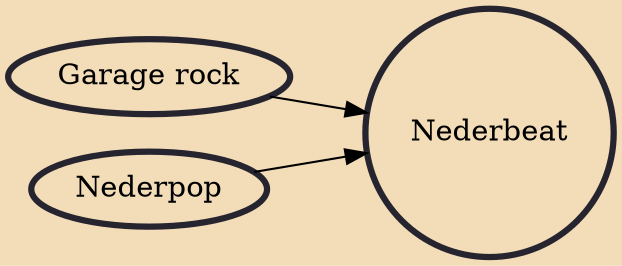

Nederbeat (also: Nederbiet) was the Dutch rock boom of mid-1960s influenced by British beat groups and rock bands such as the Beatles and the Rolling Stones and, much like British freakbeat, it is essentially the Dutch counterpart to American garage rock. Among the best-known Nederbeat groups are the Golden Earrings, The Motions, The Outsiders and Shocking Blue.

## Influences
- [[Garage rock]]
- [[Nederpop]]
