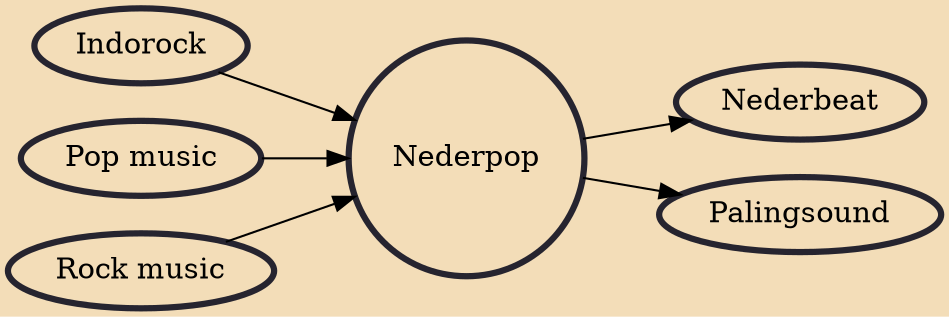

Nederpop or Dutch pop music is pop music made by Dutch bands and artists. The name is a play on the country's name in Dutch (Nederland). An English translation could be Netherpop. Nederpop is a Dutch term invented by the mid-1970s to describe the Dutch pop music scene of the 1960s and 1970s that was gaining worldwide attention, exemplified by bands such as Shocking Blue, Golden Earring and Focus. Most of the Nederpop bands of this period had English-language songs or played only instrumentals, but some of the bands performed exclusively in the Dutch language. Many such were popular thanks to airplay over the offshore pirate radio stations targeting the Netherlands such as Mi Amigo, Veronica, Atlantis and Northsea International.

## Influences
- [[Indorock]]
- [[Pop music]]
- [[Rock music]]

## Derivatives
- [[Nederbeat]]
- [[Palingsound]]
