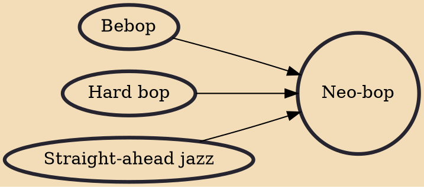

Neo-bop (also called neotraditionalist) refers to a style of jazz that gained popularity in the 1980s among musicians who found greater aesthetic affinity for acoustically based, swinging, melodic forms of jazz than for free jazz and jazz fusion that had gained prominence in the 1960s and 1970s. Neo-bop is distinct from previous bop music due to the influence of trumpeter Wynton Marsalis, who popularized the genre as an artistic and academic endeavor opposed to the countercultural developments of the beat generation.

## Influences
- [[Bebop]]
- [[Hard bop]]
- [[Straight-ahead jazz]]
